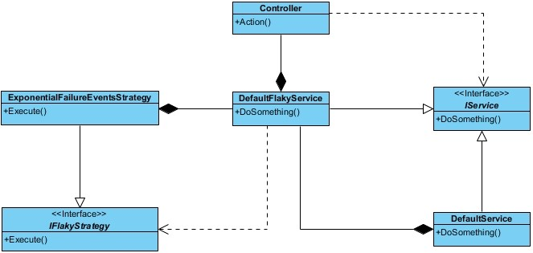
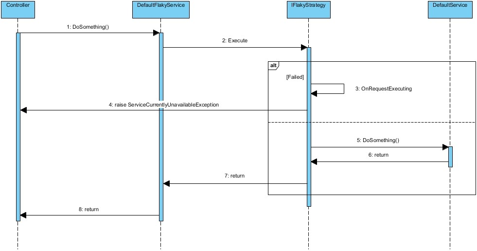
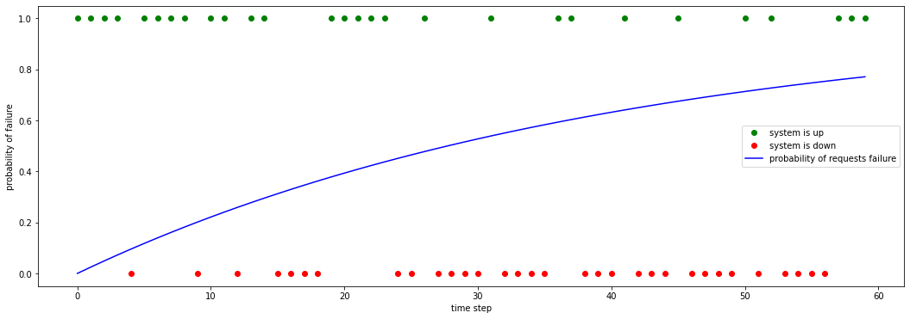

# Introduction
Distributed applications are a staple of the modern software development industry. As a programmer, building distributed systems is always not a straight job to do. Recently, Microservice architecture style has gained significant momentum, and has turned to an extremely popular architecture to overcome developing enterprise distributed systems.

A robust system keeps processing transactions, even when transient impulses, persistent stresses, or component failures disrupt normal processing. This is what most people mean by “stability”.

The terms impulse and stress come from mechanical engineering. An impulse is a rapid shock to the system. An impulse to the system is when something whacks it with a hammer. In contrast, stress to the system is a force applied to the system over an extended period.

Enterprise software must be cynical. Cynical software expects bad things to happen and is never surprised when they do. Cynical software doesn't even true itself, so it puts up internal barriers to protect itself from failures. It refuses to get too intimate with other systems, because it could get hurt.

The result of developing Software that is not cynical is poor stability, and it would carry significant real costs. When building the architecture, design, and even low-level implementation of a system, many decision points have high leverage over the system’s ultimate stability. Fortunately, there are patterns that provide the architecture and design guidance to reduce, eliminate, or mitigate the effects of cracks in the system. We apply these patterns wisely to reduce the damage done by an individual failure.

# Circuit Breaker
In a house when current electrical usage exceeded the wires started heating gradually and there might be a chance of fire. Engineers found a partial solution  to overcome this dangerous situation in the form of fuses. The entire purpose of an electrical fuse is to burn up before the house does. It’s a component designed to fail first, thereby controlling the overall failure mode.

In a distributed environment it is a common scenario to make a remote call to remote resources and service can fail due to transient faults, such as slow network connection, timeouts, or the resources temporarily unavailable. These faults typically correct themselves after a short period of time, and a robust software should be prepared to handle them by using a strategy such as the Retry pattern.

However, there can also be situations where faults are due to unanticipated events, and that might take much longer to fix.These faults can range in severity from a partial loss of connectivity to the complete failure of a service. In this situation when the system is under stress two different problems might happen. 
Unavailability:
For serving user’s requests we might need to call several remote services to play a part. Now if one of these services is down, and that results in the whole request being unavailable. What we need to do is understand the impact of each service outage, and work out how to properly degrade functionality.
Cascading failure: 
if a service is very busy, failure in one part of the system might lead to cascading failures. For example, an operation that invokes a service could be configured to implement a timeout, and reply with a failure message if the service fails to respond within this period. However, this strategy could cause many concurrent requests to the same operation to be blocked until the timeout period expires. These blocked requests might hold critical system resources such as memory, threads, database connections, and so on. Consequently, these resources could become exhausted, causing failure of other possibly unrelated parts of the system that need to use the same resources. In these situations, it would be preferable for the operation to fail immediately, and only attempt to invoke the service if it's likely to succeed. Note that setting a shorter timeout might help to resolve this problem, but the timeout shouldn't be so short that the operation fails most of the time, even if the request to the service would eventually succeed.

Solution:
برای مقابله با رفتار شکننده سرویس دهنده به یک سیستم نیاز است تا در زمان فراخوانی این سرویس های یک محافظ برای آنها در نظر گرفت. مایکل در کتاب Release It!: Design and Deploy Production-Ready Software یک راه حل کارآمد برای مقابله با این مشکل بیان کرده است. مایکل در این کتاب با توضیح مشکل که بخش های از آن در بالا آورده شده است ابتدا با تعریف دقیق مشکل و تبعات بوجود آمده توسط آن سعی کرده است با طراحی یک الگو فراخوانی سرویس های دیگر را مدیریت کند.
برای چارچوب کاری ASP.NET CORE کتابخانه متن باز Polly به خوبی به الگو را پیاده سازی کرده است.

اما یکی از مشکلات جدی برنامه نویسان در طول استفاده از الگوی اتصال کوتاه تست آن و ارزیابی سیستم زمانی می باشد که سرویس دهنده ها با مشکل مواجه شده اند و رفتاری شکنده از خود بروز می دهند. ما در اینجا سعی کرده ایم که این رفتار شکنده را شبیه سازی کنیم. در این جا میتوان رفتار نهایی هر سرویس پیاده سازی شده را با استفاده از یک استراتژی شکننده تغییر داد تا بتوان سیستم های استفاده کننده را در شرایط استرس قرارداد و رفتار آنها را در این حالت مشاهده کرد. با استفاده از این سرویس شکننده می توان برای هر سیستم بطور خاص بهترین پالیسی را برای الگوی اتصال کوتاه تنظیم کرد. 


# استراتژی شکننده
همانطور که گفته شد برای پایش و بررسی رفتار یک سیستم نیاز است تا آنرا تحت استرس قرار داد. یکی از مهمترین قسمت های سیستم که در معرض استرس می باشد فراخوانی سرویس های بیرونی مورد استفاده آن می باشد. ذر اینجا ابتدا نیاز داریم تا رفتار شکننده را پیاده سازی کنیم و در نهایت بعد از پیاده سازی از آن در یک کلاس سرویس دهنده استفاده کنیم. برای پیاده سازی رفتار های مختلف از الگوی طراحی استراتژی استفاده شده است و نیاز تا رابط برنامه نویسی زیر را پیاده سازی کنید:
 

  
```C#
/// <summary>
/// Define an interface for changing the behavior of a function to flaky.
/// <para> flaky here means an unreliable function that when it called there is a chance raise <see cref="ServiceCurrentlyUnavailableException"/> exception </para>
/// </summary>
public interface IFlakyStrategy
{
    /// <summary>
    /// A wrapper for a function which we want to turn its behavior to flaky.
    /// </summary>
    /// <typeparam name="TResult">the return type of given function</typeparam>
    /// <param name="func"></param>
    /// <param name="parameters">the input parameters of given function</param>
    /// <returns>the return type of given function</returns>
    /// <exception cref="ServiceCurrentlyUnavailableException"> Thrown when the flaky strategy want to change behavior to flaky</exception>
    Task<TResult> Execute<TResult>(Func<IDictionary<string, object>, Task<TResult>> func, IDictionary<string, object> parameters);
    
    /// <summary>
    /// After a while we can rest the flaky behavior to initial version
    /// </summary>
    /// <returns>Task</returns>
    Task Reset();
}
```
در متد `Execute` ما بعنوان ورودی تابع سرویس مورد نظر را وارد می کنیم و در خروجی توقع داریم تا خروجی مشابه سرویس وارد شده برگردانده شود. تنها در زمانی که رفتار شکننده بخواهد رفتار عادی سرویس را تغییر دهد و پاسخ درستی به فراخوانی آن توسط سرویس گیرنده نداشته باشد یک استثنا raise  میکند تا رفتار شکننده را بروز دهد.

در اینجا یک رفتار شکننده  بصورت پیشفرض برای نمایش کارکرد شکنندگی پیاده سازی کرده ایم. در این جا قصد داریم تا با گذشت عمر یک سرویس از زمانی فعالیت آن نسبت بروز رفتار های شکننده به رفتار مورد انتظار سرویس را بالا ببریم. در ابتدای شروع به سرویس دهی به فراخوانی های خارجی مانند یک سرویس سالم رفتار می کند و  رفته رفته با ارسال درخواست های بیشتر شروع  می کند رفتار های شکننده بروز دادن و با گذشت یک دوره مشخص این رفتار شکنده به اوج می رسد و مجدد مانند یک سیستم سالم رفتار می کند و این روال بطور مدام ادامه پیدا می کند. ما از توزیع نمایی برای شبیه سازی رفتار سرویس استفاده کرده ایم. در این شبیه سازی ابتدا تعداد کل درخواست های دریافتی توسط سیستم را برای یک دوره، مشخص می کنیم و همچنین در این دوره مشخص می کنیم که اولین پاسخ خراب در کدام درخواست بروز می کند(طول عمر تقریبی سرویس دهنده). برای این منظور از توزیع نمایی استفاده شده است.
در نظریه آمار و احتمالات توزیع نمایی برای تخمین مدت زمان لازم برای رخداد یک پیشامد خاص استفاده می شود. در اینجا پیشامد اولین خرابی بوجود آمده در سرویس پیاده سازی شده می باشد. توزیع نمایی یک توزیع پیوسته می باشد که تابع توزیع تجمعی آن را در زیر مشاهده می کنید:

<p align="center">
    
</p>

در تابع فوق دو پارامتر ورودی `lambda` و `x`  وجود دارد. `lambda` مقدار متوسط انتظار رخداد اولین پیشامد مورد نظر در یک دوره می باشد.  و همچنین x لحظه ای است که پیشامد رخ می دهد. بهمین ترتیب `(f(x,lambda` احتمال رخداد پیشامد خرابی در لحظه x را محاسبه می کند.
برای درک بهتر این توزیع از یک مثال استفاده می کنیم. فرض کنید سرویس ما در هر دوره کاری انتظار داریم اولین پیشامد خرابی برای درخواست 40 رخ می دهد. بنابراین مقدار `lambda` برابر است با 1/40. پس می توانیم بگویم احتمال اینکه درخواست شماره 5 یا 50 خراب باشد چقدر است؟

```python
f(5,1/40) = 0.117
f(50,1/40) = 0.713
```
کلاس `ExponentialFailureEventsStrategy` یک پیاده سازی  پیشفرض ThreadSafe برای `IFlakyStrategy`  می باشد که از توزیع نمایی برای پیاده سازی رفتار شکننده استفاده می کند. در این کلاس با استفاده از `FlakyStrategyOptions` ابتدا مقادیر اولیه برای دوره سرویس دهی و لحظه رخداد اولین پیشامد خطا مقدار دهی می شوند. 
در هر بار ارسال درخواست به سرویس متد سرویس توسط این کلاس wrapp شده است و قبل از فراخوانی سرویس اصلی استراتژی شکننده براساس تعداد درخواست پاسخ داده شده احتمال بروز خطا در درخواست جاری را محاسبه می کند و سپس با احتمالات بدست آمده برای بروز خرابی و عدم بروز خرابی یکی از پاسخ های خراب یا سالم را انتخاب می کند. اگر در این مرحله پاسخ خراب انتخاب شود یه استثنا raise  می شود تا controller فراخوانی کننده این خرابی سرویس را به کلاینت ها اعلام کند. همچنین اگر تعداد درخواست های ارسال شده به کلاس از دوره سرویس دهی بیشتر شود تنظیمات به حالت اولیه برمی گردد و تعداد درخواست های پاسخ داده شده صفر می شود.

```C#
public static double ExponentialDistributionCdfFunc(double lambda, int timeStep) => 1 - Math.Exp(-lambda * timeStep);

private void OnRequestExecuting()
{
    lock (_lock)
    {
        var failureEventProbability = StatisticalUtils.ExponentialDistributionCdfFunc(_lambda, _timeStep);
        var isSystemUp = StatisticalUtils.NonUniformRandomChoice(new[] { 1 - failureEventProbability, failureEventProbability });
        _timeStep++;

        if (_timeStep == _timeStepInterval)
            Reset();

        if (isSystemUp == 1)
            throw new ServiceCurrentlyUnavailableException();
    }
}

```

# Flaky API
برای پیاده سازی یک سرویس مبتنی رفتار شکننده ما یک سرویس دلخواه با استفاده از `IService` پیاده سازی می کنیم و سپس توسط الگوی طراحی Decorator سرویس را به سرویسی با رفتار شکننده تغییر می دهیم. در پیاده سازی سرویس شکننده از یک پیاده سازی `IFlakyStrategy` که قبلا توضیح داده شود استفاده می کنیم. در زیر نمودار ارتباط کلاس های مورد نیاز نشان داده شده است:


<p align="center">
    
</p>

در اینجا سرویس DefaultService که یک سرویس تنها با یک متد می باشد را پیاده سازی کرده ایم. از این کلاس بعنوان یک سرویس دهنده اصلی استفاده  می کنیم تا رفتار این سرویس دهنده را با استفاده از الگوی استراتژی که قبلا شرح داده شد به یک سرویس با رفتار شکننده تغییر دهیم. در این زیر پیاده سازی این سرویس را مشاهده می کنید:

```C#
public class DefaultService : IService
{
    private readonly ILogger<DefaultService> _logger;

    public DefaultService(ILogger<DefaultService> logger)
    {
        _logger = logger;
    }

    public Task<DefaultResponse> DoSomething()
    {
        var result = new DefaultResponse { SystemStatus = "Up", SystemTicks = DateTime.UtcNow.Ticks };
        _logger.LogInformation("{0} is called at {1}", nameof(DoSomething), result.SystemTicks);
        return Task.FromResult(result);
    }
}

```

در اینجا می خواهیم با استفاده از الگوی طراحی دکورتیور یک سرویس دقیقا مانند سرویس `DefaultService` پیاده سازی کنیم که به آن رفتار شکننده وارد می کنند .استفاده از رفتار شکننده پیاده سازی شده برای این کلاس توسط رابط `IFlakyStrategy` با استفاده از Dependency Injection مدیریت می شود. در زیر پیاده سازی کلاس `DefaultFlakyService` این را مشاهده می کنید:

```C#

public class DefaultFlakyService : IService
{
    private readonly ILogger<DefaultFlakyService> _logger;
    private readonly IService _service;
    private readonly IFlakyStrategy _flakyStrategy;
    public DefaultFlakyService(ILogger<DefaultFlakyService> logger, IService service, IFlakyStrategy flakyStrategy)
    {
        _logger = logger;
        _service = service;
        _flakyStrategy = flakyStrategy;
    }

    public async Task<DefaultResponse> DoSomething()
    {
        return await _flakyStrategy.Execute(async ctx => await _service.DoSomething(), null);
    }
}
```

# Dependency Injection

همانطور که می دانید asp.net core  با استفاده از یک پیاده سازی پیشفرض تکنیک  Inversion of Control (IoC) را بین کلاس ها و وابستگی های آنها مدیریت می کند. یکی از مهمترین ضعف های این پیاده سازی پیشفرض مدیریت کلاس های پیاده سازی شده براساس الگوی طراحی Decorator می باشد. بهمین خاطر برای غلبه بر این مشکل از کتابخانه autofac استفاده شده است. ایجاد کلاس ها و وابستگی ها آنها با استفاده از Autofac را در زیر مشاهده می کنید:

```C#
public class AutofacModule : Module
{
    protected override void Load(ContainerBuilder builder)
    {
        builder.RegisterType<DefaultService>().As<IService>().SingleInstance();
        builder.RegisterType<ExponentialFailureEventsStrategy>().As<IFlakyStrategy>().SingleInstance();
        builder.RegisterDecorator<DefaultFlakyService, IService>();
    }
}

```

همانطور که مشخص است براساس ترتیب تعریف وابستگی ها هر بار که نیاز به یک `IService` داشته باشیم autofac مانند شکل زیر عمل میکند و فراخوانی ها را به ترتیب تعریف شده در کلاس `AutofacModule` در زمان اجرای برنامه مدیریت می کند.

<p align="center">
    
</p>

# Client

در اینجا برای بررسی رفتار شکننده پیاده سازی شده در قسمت قبل از یک کلاینت پیاده سازی شده با پایتون استفاده می شود. در زیر کلاس `FlakyClient` که سرویس REST API را پیاده سازی کرده است را مشاهده می کنید:

```python
class FlakyClient:
    def __init__(self, base_url):
        self._base_url = base_url

    def call_status(self):
        response = requests.get(f"{self._base_url}/CircuitBreaker/Status", verify=False)
        return response.status_code, response.json()

    def call_reset(self):
        response = requests.get(f"{self._base_url}/CircuitBreaker/Reset", verify=False)
        return response.status_code

    def call_settings(self):
        response = requests.get(f"{self._base_url}/CircuitBreaker/Settings", verify=False)
        return response.status_code, response.json()

```

حال در این مرحله با استفاده مقدار `total_time_of_interval` که در سرویس رفتار شکنده مقدار شده است درخواست به سرویس ارسال می شود و پاسخ های سالم و خراب جمع آوری می شود. همچنین با استفاده از یک تابع توزیع نرمال در هر شماره درخواست احتمال اینکه سرویس پاسخ خراب بدهده نیز محاسبه می شود. رفتار نهایی سرویس در شکل زیر بعد از ارسال 60 درخواست در دیاگرام زیر نمایش داده شده است.

```python
service_is_up = np.zeros(total_requests)
service_is_downs = np.zeros(total_requests)
failure_probability = np.zeros(total_requests)
for request_number in range(total_requests):
    failure_probability[request_number] = exponential_cdf(lmbda, request_number)
    status_code, info = flaky_client.call_status()
    print(status_code, end=' ')
    if status_code == 200:
        service_is_up[request_number] = 1
        service_is_downs[request_number] = np.nan
    else:
        service_is_up[request_number] = np.nan
        service_is_downs[request_number] = 0

fig, ax = plt.subplots(figsize=(18, 6))
ax.plot(range(total_requests), service_is_up, 'go', label='system is up')
ax.plot(range(total_requests), service_is_downs, 'ro', label='system is down')
ax.plot(range(total_requests), failure_probability, 'b', label='probability of requests failure')
ax.set_xlabel('time step')  # Add an x-label to the axes.
ax.set_ylabel('probability of failure')  # Add a y-label to the axes.
ax.legend()
```

<p align="center">
    
</p>

# Summary

# Resources
1.	Release It!: Design and Deploy Production-Ready Software 

